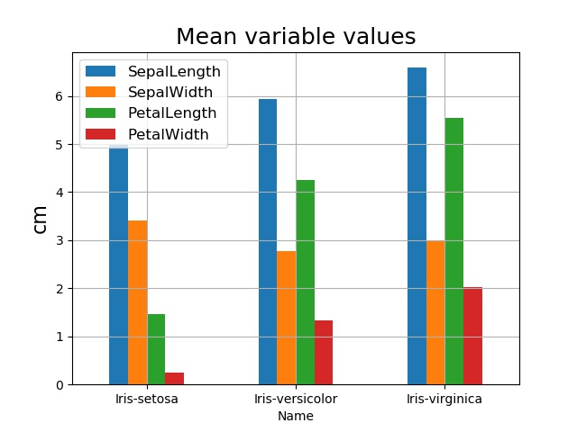

# pands-project
## Elizabeth Daly
### January-April 2019
### HDip Data Analytics 2019 Programming and Scripting Project

Git-hub repository at:
https://github.com/elizabethdaly/pands-project.git

# The Fisher Iris Data Set

## Introduction
Sir Ronald Fisher (1890-1962) was a British statistician and biologist who is best known for his work in the application of statistics to the design of scientific experiments. Following undergraduate study in mathematics at the University of Cambridge, he remained there for postgraduate work in physics, including the theory of errors. He continued his research in statistics over the next few years while working in various jobs - insurance company ststistician and teacher. In 1919 he became the statistician at the Rothamsted Experimental Station in Hertfordshire, where he had access to huge amounts of agricultural data. Here, he developed and applied statistical methods to the design of plant breeding experiments in order to get maximum useful information from the experiments while minimizing time, effort, and money. He held academic positions at University College London and Cambridge University before retiring to Australia, where he died in 1962. During his career he published many articles and books on various topics in statistics and genetics, including the method of maximum likelihood estimation and the analysis of variance.

Fisher introduced the iris flower data set and the linear discriminent analysis (LDA) in a 1936 publication. LDA is a method to reduce the number of dimensions in data sets in order to perform pattern classification or machine learning. As the MathWorks reference below states, if one has a data set containing observations with measurements on many variables and their known classes, could this data be used to determne which class measurements from new  observations are most likely to belong to? It seems to be a popular data set for demonstrating how to perform classification and for providing training sets in machine learning (see Wolfram reference below).  

## Exploratory data analysis
When starting this project I often encountered the term "Exploratory Data Analysis" (EDA). I found a good definition on the towardsdatascience website: 
_Data Analysis refers to the critical process of performing initial investigations on data so as to discover patterns, to spot anomalies, to test hypothesis and to check assumptions with the help of summary statistics and graphical representations._ For this project, we are performing EDA on the Iris data set.

## Description of the data set
Fisher's (or Anderson's) iris data set gives the measurements in centimetres of the variables sepal length, sepal width, petal length, and petal width (in that order) for 50 flowers from each of three species of iris. The species are _Iris setosa_, _Iris versicolor_, and _Iris virginica_. The data set consists of 150 rows or observations (50 samples from each species) by five columns. The first four columns contain the samples/measurements and the fifth contains the species name (or class). I obtained the data set as a csv file from GitHub as detailed below.

## Initial analysis of full data set
The Python script **get-data.py** reads the csv file containing the data set **iris.csv** (located in the same directory) and does some basic analysis. I import the modules I need for data analysis and plotting: Pandas, NumPy and matplotlib. The csv file is then read into a DataFrame - the basic data format for Pandas. Each row of a DataFrame represents a sample of data, with each column containing a different variable; the format is therefore compatible with the Iris Data Set we are investigating for this project. I use various **Pandas** functions as follows:
* .read_csv() to read the file into a DataFrame.
* .info() to get a brief summary of the resulting DataFrame. 
* .head() to look at the first few lines of the data set.
* .dtypes to find the data types of each column.
* .shape to find the number of rows and columns in the dataframe.
* .columns to find the labels of each column.
* .describe() to generate some descriptive statistics for each column of numeric data. The output of describe() is another dataframe.

The head of the file looks like:

SepalLength | SepalWidth | PetalLength | PetalWidth | Name
------------|------------|-------------|------------|-----
5.1 | 3.5 | 1.4 | 0.2 | Iris-setosa
4.9 | 3.0 | 1.4 | 0.2 | Iris-setosa
4.7 | 3.2 | 1.3 | 0.2 | Iris-setosa
4.6 | 3.1 | 1.5 | 0.2 | Iris-setosa
5.0 | 3.6 | 1.4 | 0.2 | Iris-setosa

The column labels are SepalLength, SepalWidth, PetalLength, and PetalWidth all of type float64. The fifth column label is Name of type object (or string); it holds the name of the species. The dataframe size is 150 rows x 5 columns. There are no null values.

### Plotting the full data set

I then plot the data columns as seperate data series on a single plot using **matplotlib**. I explain the commands here the first time I use them.
* plt.xlim() to set x axis range.
* plt.xticks() to place tick marks on the x axis in positions defined by a **NumPy** .arange() command.
* plt.gca() keeps track of the axes so that many columns (or data series) can be plotted on the same graph.
* plt.title(), plt.ylabel(), and plt.xlabel() set up the graph titles and x and y axes labels.
* plt.legend() to add a legend and place it in the 'best' location given the shape of the curves.
* plt.grid() to add gridlines.
* plt.savefig() to save the figure.
* plt.show() to display it.

The jumps in observation values from species to species are very obvious in this figure, apart from in the case of SepalWidth (green curve). For that reason, I think it would probably be more instuctive to analyse the observations applying to each species seperately.

### Descriptive statistics of full data set

The descriptive statistics of the full data set is as follows:

Property |SepalLength | SepalWidth | PetalLength | PetalWidth
---------|------------|------------|-------------|-----------
count | 150.000000 |150.000000 | 150.000000 | 150.000000
mean | 5.843333 | 3.054000 | 3.758667 | 1.198667
std | 0.828066 | 0.433594 | 1.764420 | 0.763161
min | 4.300000 | 2.000000 | 1.000000 | 0.100000
25% | 5.100000 | 2.800000 | 1.600000 | 0.300000
50% | 5.800000 | 3.000000 | 4.350000 | 1.300000
75% | 6.400000 | 3.300000 | 5.100000 | 1.800000
max | 7.900000 | 4.400000 | 6.900000 | 2.500000

Here, count is the number of observations, mean is the mean of the values, std is the standard deviation, and min (max) is the minimum (maximum) of the values. The standard deviation indicates the amount of spread in the values; if it is large then the values are spread over a wide range, while a small standard deviation means that the values are more tightly clustered around the mean. A quick glance at the table of results above shows that the values of SepalLength and  SepalWidth seem to cluster around the mean while the values of PetalLength and PetalWidth have a very large spread in values. 25%, 50%, and 75% are the 25th, 50th, and 75th percentiles respectively. The 50th percentile is equivalent to the median value of the observations. The 50% value is close to the mean for SepalWidth and SepalLength but not so for PetalLength and PetalWidth. Bear in mind that these summary statistics apply to all 150 observations rather than to each species seperately (_i.e._ to each set of 50 observations). In the bar plot of the dataframe, each column corresponds to a colour while each row is nested in a group on the x axis. I use **Pandas** .iloc to select the data I wish to display in the bar plot by using integer-location based indexing into the summary statistics dataframe.

## Seperate the data into distinct species

The Python script **stats-per-species.py** investigates the basic properties of the data set on a per species basis. I use **Pandas** .loc() to select groups of rows and columns based on labels. For example, all rows with the label "Name = Iris-setosa" are extracted from the master data set and read into a new DataFrame of size (50,5): 50 rows (observations) and 5 columns (variables) with labels SepalLength etc as above. The summary statistics of each species are then found and are displayed below.

Species     |setosa    | versicolor | virginica 
------------|----------|------------|-----------
**SepalLength** |
mean        | 5.00600  | 5.936000   | 6.58800
std         | 0.35249  | 0.516171   | 0.63588
min         | 4.30000  | 4.900000   | 4.90000
50%         | 5.00000  | 5.900000   | 6.50000
max         | 5.80000  | 7.000000   | 7.90000
**SepalWidth**  |
mean        | 3.418000 | 2.77000    | 2.974000
std         | 0.381024 | 0.313798   | 0.322497
min         | 2.300000 | 2.000000   | 2.200000
50%         | 3.400000 | 2.800000   | 3.000000
max         | 4.400000 | 3.400000   | 3.800000
**PetalLength** |
mean        | 1.464000  | 4.260000  | 5.552000
std         | 0.173511  | 0.469911  | 0.551895
min         | 1.000000  | 3.000000  | 4.500000
50%         | 1.500000  | 4.350000  | 5.550000
max         | 1.900000  | 5.100000  | 6.900000
**PetalWidth**  |
mean        | 0.24400   | 1.326000  | 2.02600
std         | 0.10721   | 0.197753  | 0.27465
min         | 0.10000   | 1.000000  | 1.40000
50%         | 0.20000   | 1.300000  | 2.00000
max         | 0.60000   | 1.800000  | 2.50000

Another way to look at the ststistics per species is to use Pandas groupby() to group the data by species name, and obtain statistics about each variable.

Mean(cm)  | SepalLength | SepalWidth | PetalLength | PetalWidth
----------|-------------|------------|-------------|------------
Iris-setosa     | 5.006 | 3.418 | 1.464 | 0.244
Iris-versicolor | 5.936 | 2.770 | 4.260 | 1.326
Iris-virginica  | 6.588 | 2.974 | 5.552 | 2.026

Std(cm)   | SepalLength | SepalWidth | PetalLength | PetalWidth
----------|-------------|------------|-------------|------------
Iris-setosa     | 0.352490 | 0.381024 | 0.173511 | 0.107210
Iris-versicolor | 0.516171 | 0.313798 | 0.469911 | 0.197753
Iris-virginica  | 0.635880 | 0.322497 | 0.551895 | 0.274650

 

## Conclusion

**List of Python scripts**
* get-data.py
* stats-per-species.py

**References**
1. Sir Ronald Fisher: https://www.britannica.com/biography/Ronald-Aylmer-Fisher 
2. Sir Ronald Fisher: https://study.com/academy/lesson/sir-ronald-fisher-biography-contributions-to-statistics.html
3. Linear Discriminant Analysis: https://sebastianraschka.com/Articles/2014_python_lda.html
4. Exploratory Data Analysis: https://towardsdatascience.com/exploratory-data-analysis-8fc1cb20fd15
5. MathWorks: https://uk.mathworks.com/help/stats/examples/classification.html
6. Wolfram Data Repository: https://datarepository.wolframcloud.com/resources/Sample-Data-Fishers-Irises
7. Iris data set: https://github.com/pandas-dev/pandas/blob/master/pandas/tests/data/iris.csv
8. pandas Python data analysis library: https://pandas.pydata.org/
9. matplotlib Python 2D plotting library: https://matplotlib.org/
10. Pandas DataFrames: https://www.shanelynn.ie/using-pandas-dataframe-creating-editing-viewing-data-in-python/
11. Plotting examples: http://queirozf.com/entries/pandas-dataframe-plot-examples-with-matplotlib-pyplot
12. https://tomaugspurger.github.io/modern-1-intro.html
