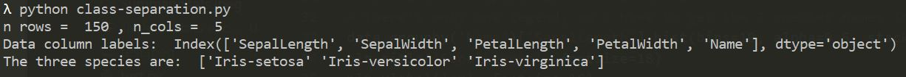

# pands-project
## Elizabeth Daly
### January-April 2019
### HDip Data Analytics 2019 Programming and Scripting Project

Git-hub repository at:
https://github.com/elizabethdaly/pands-project.git

# The Fisher Iris Data Set

# Table of contents
1. [Introduction](#introduction)
    1. [Ronald Fisher](#introRF)
    2. [Exploratory data analysis](#EDA)
    3. [Description of the data set](#datadescription)
2. [Full data set initial analysis](#paragraph2)
    1. [Plotting the full data set](#plotall)
    2. [Descriptive statistics of the full data set](#statsall)
3. [Seperate the data into distinct species](#paragraph3)
4. [Discriminating between species](#paragraph4)
5. [Other work](#paragraph5)
6. [Conclusion](#conclusion)
6. [List of Python scripts](#scripts)
7. [References](#references)

## This is the introduction 
Some introduction text, formatted in heading 2 style

## Some paragraph 
The first paragraph text

### Sub paragraph 
This is a sub paragraph, formatted in heading 3 style

## Another paragraph 
The second paragraph text

## Introduction 

### Ronald Fisher 
Sir Ronald Fisher (1890-1962) was a British statistician and biologist who is best known for his work in the application of statistics to the design of scientific experiments. Following undergraduate study in mathematics at the University of Cambridge, he remained there for postgraduate work in physics, including the theory of errors. He continued his research in statistics over the next few years while working in various jobs - insurance company ststistician and teacher. In 1919 he became the statistician at the Rothamsted Experimental Station in Hertfordshire, where he had access to huge amounts of agricultural data. Here, he developed and applied statistical methods to the design of plant breeding experiments in order to get maximum useful information from the experiments while minimizing time, effort, and money. He held academic positions at University College London and Cambridge University before retiring to Australia, where he died in 1962. During his career he published many articles and books on various topics in statistics and genetics, including the method of maximum likelihood estimation and the analysis of variance.

Fisher introduced the iris flower data set and the linear discriminent analysis (LDA) in a 1936 publication. LDA is a method to reduce the number of dimensions in data sets in order to perform pattern classification or machine learning. As the MathWorks reference below states, if one has a data set containing observations with measurements on many variables and their known classes, could this data be used to determne which class measurements from new  observations are most likely to belong to? It seems to be a popular data set for demonstrating how to perform classification and for providing training sets in machine learning (see Wolfram reference below).  

### Exploratory data analysis 
When starting this project I often encountered the term "Exploratory Data Analysis" (EDA). I found a good definition on the towardsdatascience website: 
_Data Analysis refers to the critical process of performing initial investigations on data so as to discover patterns, to spot anomalies, to test hypothesis and to check assumptions with the help of summary statistics and graphical representations._ For this project, we are performing EDA on the Iris data set.

### Description of the data set 
Fisher's (or Anderson's) iris data set is a multivariate data set as each observation/sample consists of four variables. It contains the measurements in centimetres of the variables sepal length, sepal width, petal length, and petal width (in that order) for 50 flowers from each of three species of iris. The species are _Iris setosa_, _Iris versicolor_, and _Iris virginica_. The data set consists of 150 rows or observations (50 samples from each species) by five columns. The first four columns contain the samples/measurements and the fifth contains the species name (or class). I obtained the data set as a csv file from GitHub as detailed below.

##  Full data set initial analysis 
Python script: **get-data.py** 

This script reads the csv file containing the data set **iris.csv** (located in the same directory) and does some basic analysis. I import the modules I need for data analysis and plotting: Pandas, NumPy and matplotlib. The csv file is then read into a DataFrame - the basic data format for Pandas. Each row of a DataFrame represents a sample of data, with each column containing a different variable; the format is therefore compatible with the Iris Data Set we are investigating for this project. I use various **Pandas** functions as follows:
* .read_csv() to read the file into a DataFrame.
* .info() to get a brief summary of the resulting DataFrame. 
* .head() to look at the first few lines of the data set.
* .dtypes to find the data types of each column.
* .shape to find the number of rows and columns in the dataframe.
* .columns to find the labels of each column.
* .describe() to generate some descriptive statistics for each column of numeric data. The output of describe() is another dataframe.

The output of **get-data.py** looks like:

The column labels are SepalLength, SepalWidth, PetalLength, and PetalWidth all of type float64. The fifth column label is Name of type object (or string); it holds the name of the species. The dataframe size is 150 rows x 5 columns. There are no null values. The head of the file is printed to the screen in the image above and gives an idea of its structure.

### Plotting the full data set 

I then plot the data columns as seperate data series on a single plot using **matplotlib**. I explain the commands here the first time I use them.
* plt.xlim() to set x axis range.
* plt.xticks() to place tick marks on the x axis in positions defined by a **NumPy** .arange() command.
* plt.gca() keeps track of the axes so that many columns (or data series) can be plotted on the same graph.
* plt.title(), plt.ylabel(), and plt.xlabel() set up the graph titles and x and y axes labels.
* plt.legend() to add a legend and place it in the 'best' location given the shape of the curves.
* plt.grid() to add gridlines.
* plt.savefig() to save the figure.
* plt.show() to display it.

The jumps in observation values from species to species are very obvious in this figure, apart from in the case of SepalWidth (green curve). For that reason, I think it would probably be more instuctive to analyse the observations applying to each species seperately.

### Descriptive statistics of the full data set 

The descriptive statistics of the full data set is as follows:

Property |SepalLength | SepalWidth | PetalLength | PetalWidth
---------|------------|------------|-------------|-----------
count | 150.000000 |150.000000 | 150.000000 | 150.000000
mean | 5.843333 | 3.054000 | 3.758667 | 1.198667
std | 0.828066 | 0.433594 | 1.764420 | 0.763161
min | 4.300000 | 2.000000 | 1.000000 | 0.100000
25% | 5.100000 | 2.800000 | 1.600000 | 0.300000
50% | 5.800000 | 3.000000 | 4.350000 | 1.300000
75% | 6.400000 | 3.300000 | 5.100000 | 1.800000
max | 7.900000 | 4.400000 | 6.900000 | 2.500000

Here, count is the number of observations, mean is the mean of the values, std is the standard deviation, and min (max) is the minimum (maximum) of the values. The standard deviation indicates the amount of spread in the values; if it is large then the values are spread over a wide range, while a small standard deviation means that the values are more tightly clustered around the mean. A quick glance at the table of results above shows that the values of SepalLength and  SepalWidth seem to cluster around the mean while the values of PetalLength and PetalWidth have a very large spread in values. 25%, 50%, and 75% are the 25th, 50th, and 75th percentiles respectively. The 50th percentile is equivalent to the median value of the observations. The 50% value is close to the mean for SepalWidth and SepalLength but not so for PetalLength and PetalWidth. Bear in mind that these summary statistics apply to all 150 observations rather than to each species seperately (_i.e._ to each set of 50 observations). In the bar plot of the dataframe, each column corresponds to a colour while each row is nested in a group on the x axis. I use **Pandas** .iloc to select the data I wish to display in the bar plot by using integer-location based indexing into the summary statistics dataframe.

## Seperate the data into distinct species 

Python script: **stats-per-species.py** 

I used this script to investigate the basic properties of the data set on a per species basis. I use **Pandas** .loc() to select groups of rows and columns based on labels. For example, all rows with the label "Name = Iris-setosa" are extracted from the master data set and read into a new DataFrame of size (50,5): 50 rows (observations) and 5 columns (variables) with labels SepalLength etc as above. The summary statistics of each species are then found and are displayed below.
Interesting python commamds used here include:
* setosa = data.loc[data['Name'] == "Iris-setosa"] to select a subset of data based on class.
* setosa_summary.loc[['mean', 'std', '50%']].plot.bar() to select part of a DataFrame for plotting.
* data.groupby('Name')['SepalLength', 'SepalWidth', 'PetalLength', 'PetalWidth'].mean() to calculate the mean of each variable grouped by Name = species.
* setosa.boxplot() to calculate a boxplot of the setosa DataFrame for example.

**SepalLength**| setosa   | versicolor | virginica |**SepalWidth**| setosa   | versicolor | virginica
---------------|----------|------------|-----------|--------------|----------|------------|----------
**mean**       | 5.00600  | 5.936000   | 6.58800   | **mean** | 3.418000     | 2.77000    | 2.974000
**std**        | 0.35249  | 0.516171   | 0.63588   | **std**  | 0.381024     | 0.313798   | 0.322497
**min**        | 4.30000  | 4.900000   | 4.90000   | **min**  | 2.300000     | 2.000000   | 2.200000
**50%**        | 5.00000  | 5.900000   | 6.50000   | **50%**  | 3.400000     | 2.800000   | 3.000000
**max**        | 5.80000  | 7.000000   | 7.90000   | **max**  | 4.400000     | 3.400000   | 3.800000

**PetalLength**| setosa   | versicolor | virginica |**PetalWidth**| setosa   | versicolor | virginica
---------------|----------|------------|-----------|--------------|----------|------------|----------
**mean**       | 1.464000  | 4.260000  | 5.552000  | **mean** | 0.24400      | 1.326000  | 2.02600
**std**        | 0.173511  | 0.469911  | 0.551895  | **std**  | 0.10721      | 0.197753  | 0.27465
**min**        | 1.000000  | 3.000000  | 4.500000  | **min**  | 0.10000      | 1.000000  | 1.40000
**50%**        | 1.500000  | 4.350000  | 5.550000  | **50%**  | 0.20000      | 1.300000  | 2.00000
**max**        | 1.900000  | 5.100000  | 6.900000  | **max**  | 0.60000      | 1.800000  | 2.50000

Another way to look at the statistics per species is to use **Pandas** groupby() to group the data according to species name and obtain statistics about each variable.

Mean(cm)  | SepalLength | SepalWidth | PetalLength | PetalWidth
----------|-------------|------------|-------------|------------
Iris-setosa     | 5.006 | 3.418 | 1.464 | 0.244
Iris-versicolor | 5.936 | 2.770 | 4.260 | 1.326
Iris-virginica  | 6.588 | 2.974 | 5.552 | 2.026

Std(cm)   | SepalLength | SepalWidth | PetalLength | PetalWidth
----------|-------------|------------|-------------|------------
Iris-setosa     | 0.352490 | 0.381024 | 0.173511 | 0.107210
Iris-versicolor | 0.516171 | 0.313798 | 0.469911 | 0.197753
Iris-virginica  | 0.635880 | 0.322497 | 0.551895 | 0.274650

I later realsied that I could investigate the distribution of variables using **Matplotlib**
boxplot, which makes a box and whisker plot for each column of the DataFrame. The box extends 
from the lower to upper quartile values of the data, with a line at the median. The whiskers 
extend from the box to show the range of the data. Outliers are those data points past the 
ends of the whiskers. The result is a very good visual summary of the data. Any observations? Few outliers. 

## Discriminating between species 
Python script: **class-separation.py**

While researching the iris data set I found that there are lots of example analyses online; these include very simple ones which just describe the data set, to very complicated machine learning and LDA and PCA analyses. It seems to be commonly used to demonstrate classification problems such as how to seperate classes from each other and how to predict which class a sample belongs to if the class label for that sample is unknown. The classes here are the three species, there are 50 samples per class, with each sample consisting of four variables or attributes (SepalLength, SepalWidth, PetalLength, PetalWidth).
The output of **class-separation.py** looks like:

I started by asking if the variables for each class are well separated from each other? If they are, then it could be possible to predict which species a particular observation belongs to given a variable value. I plotted  histograms of each attribute for all three species at the same time using the **Pandas** groupby() and hist() functions. 
* species = data.Name.unique() to store the unique values in DataFrame data['Name'] column.
* .hist() kwargs alpha=0.5 (0.0 transparent through 1.0 opaque) to see overlapping histograms.
* .hist() parameter Stacked=True so that multiple data are stacked on top of each other.
* plt.legend((species), loc='best', fontsize=12) to get the correct legend for each plot. I spent a long time trying to get this right as trying to insert a legend with hist(label=) resulted in all histograms having the same legend, the first one in species array. I found out that there is only one legend per plot, so it needs to be updated each time a histogram is drawn on a given plot. This syntax was able to do that.

Try subplot. Explain graphs.

plot sepal length vs width
plot petal length vs width
Fitting

## Other work 

## Conclusion 

## List of Python scripts 
* get-data.py
* stats-per-species.py
* class-separation.py

## References 
1. Sir Ronald Fisher: https://www.britannica.com/biography/Ronald-Aylmer-Fisher 
2. Sir Ronald Fisher: https://study.com/academy/lesson/sir-ronald-fisher-biography-contributions-to-statistics.html
3. Linear Discriminant Analysis: https://sebastianraschka.com/Articles/2014_python_lda.html
4. Exploratory Data Analysis: https://towardsdatascience.com/exploratory-data-analysis-8fc1cb20fd15
5. MathWorks: https://uk.mathworks.com/help/stats/examples/classification.html
6. Wolfram Data Repository: https://datarepository.wolframcloud.com/resources/Sample-Data-Fishers-Irises
7. Iris data set: https://github.com/pandas-dev/pandas/blob/master/pandas/tests/data/iris.csv
8. pandas Python data analysis library: https://pandas.pydata.org/
9. matplotlib Python 2D plotting library: https://matplotlib.org/
10. Pandas DataFrames: https://www.shanelynn.ie/using-pandas-dataframe-creating-editing-viewing-data-in-python/
11. Plotting examples: http://queirozf.com/entries/pandas-dataframe-plot-examples-with-matplotlib-pyplot
12. Examples of working with DataFrames: https://tomaugspurger.github.io/modern-1-intro.html
13. Typical data analyses: https://machinelearningmastery.com/quick-and-dirty-data-analysis-with-pandas/
14. Visualising data with Python: https://www.analyticsvidhya.com/blog/2015/05/data-visualization-python/
15. The iris data set in scikit-learn: https://scikit-learn.org/stable/auto_examples/datasets/plot_iris_dataset.html
16. Scikit-learn iris data set analyses: https://scikit-learn.org/stable/modules/generated/sklearn.datasets.load_iris.html
17. Image of iris species: https://medium.com/@pranav_suresh/iris-classification-using-logistic-regression-using-octave-873bca96ec5b
18. Idea for histograms of attribute for three species at same time: https://stackoverflow.com/questions/45721083/unable-to-plot-4-histograms-of-iris-dataset-features-using-matplotlib
19. Table of contents in markdown: https://stackoverflow.com/questions/11948245/markdown-to-create-pages-and-table-of-contents