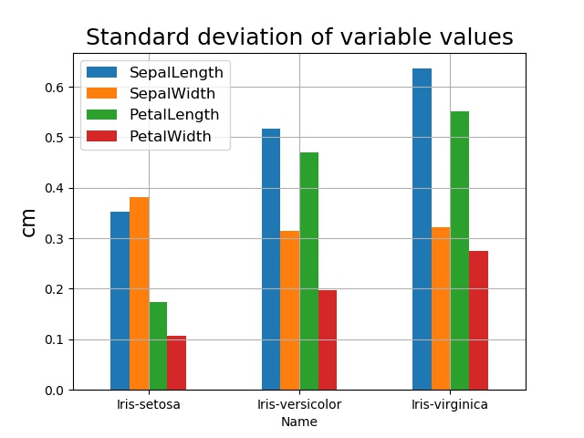
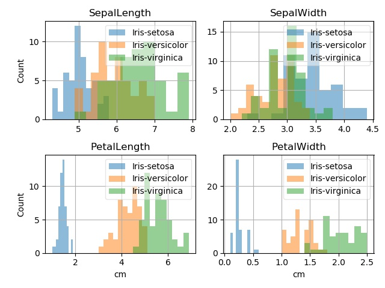
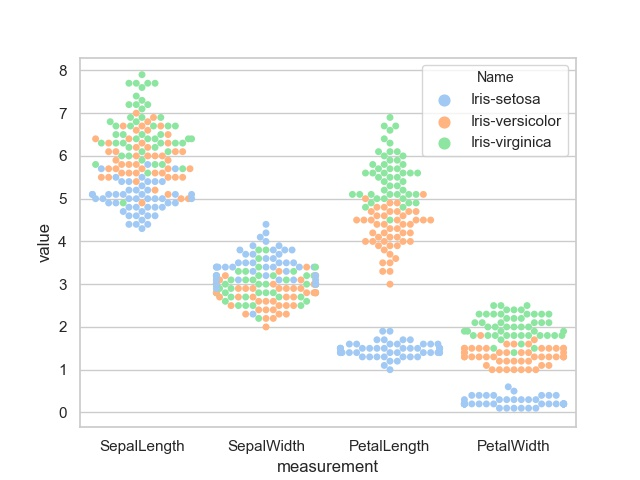
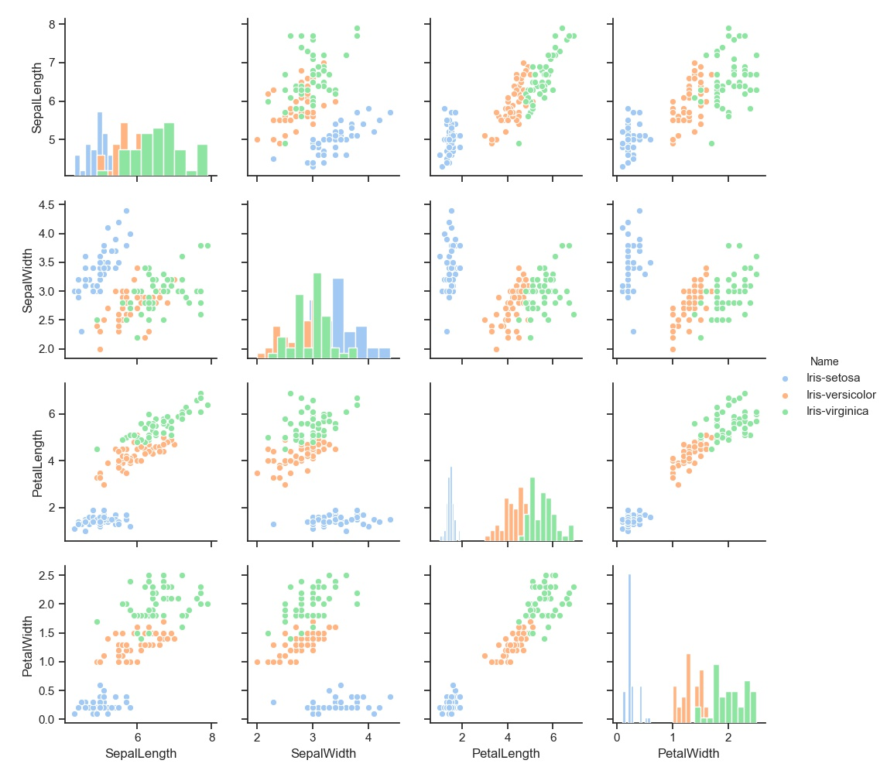
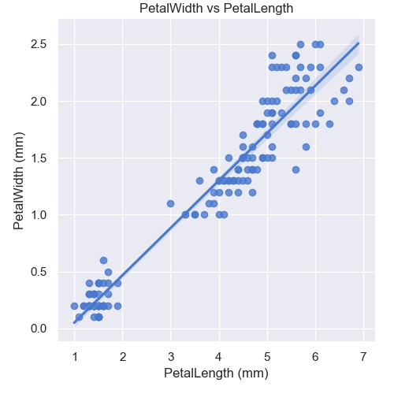
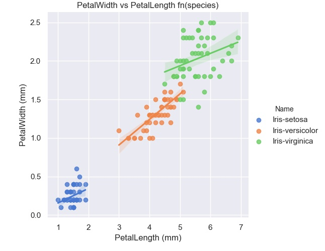
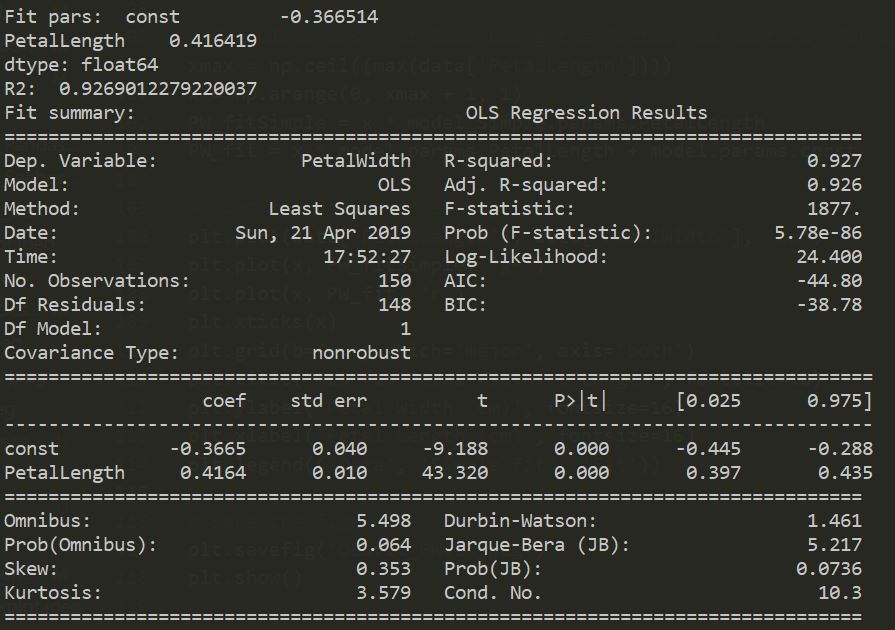
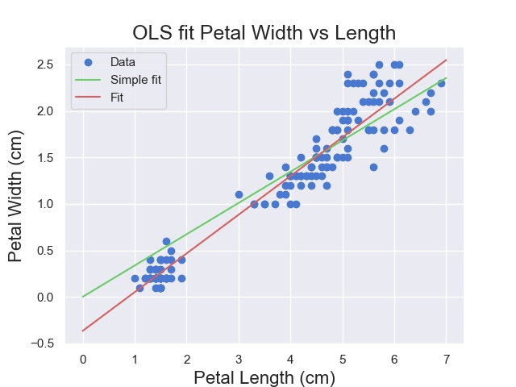
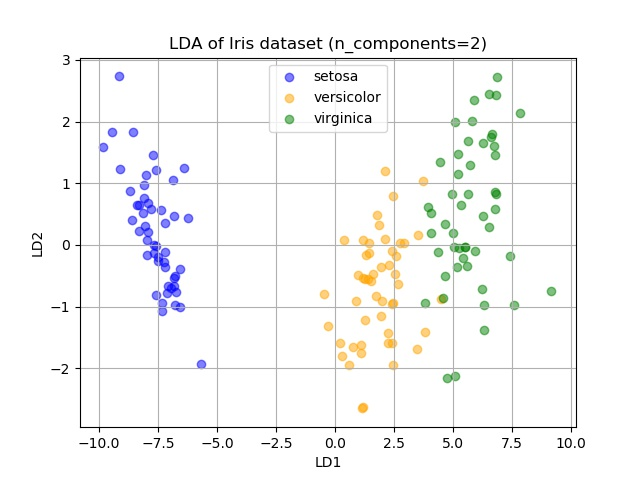
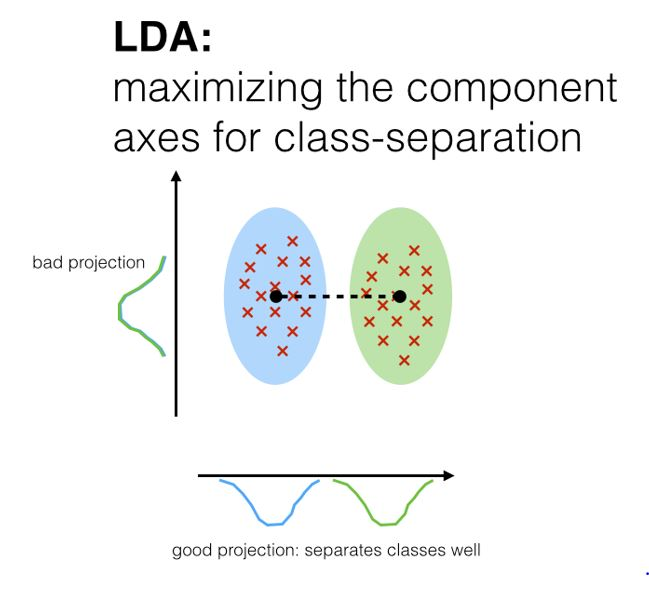

# pands-project
## Elizabeth Daly
### January-April 2019
### HDip Data Analytics 2019 Programming and Scripting Project

Git-hub repository at:
https://github.com/elizabethdaly/pands-project.git

# The Fisher Iris Data Set

# Table of contents
1. [Introduction](#introduction)
    1. [Ronald Fisher](#introRF)
    2. [Exploratory data analysis](#EDA)
    3. [Description of the data set](#datadescription)
2. [Initial analysis of the full data set](#paragraph2)
    1. [Plotting the full data set](#plotall)
    2. [Descriptive statistics of the full data set](#statsall)
3. [Seperate the data into distinct species](#paragraph3)
    1. [Summary statistics for each species](#statsperspecies)
    2. [Boxplots](#boxp)
4. [Discriminating between species](#paragraph4)
    1. [Histograms of variable values](#histall)
    2. [Swarmplot of variable values](#swarmall)
5. [Relationships between variables](#paragraph5)
    1. [Scatter matrix](#scatter)
    2. [Linear regression in Seaborn](#linregSB)
    3. [Least squares fitting using statsmodels](#lsq)
6. [Work done by other people on the Iris data set](#others)
    1. [Machine learning](#machinelearning)
    2. [Example of LDA](LDA)
7. [Conclusion](#conclusion)
8. [List of Python scripts](#scripts)
9. [References](#references)

## Introduction 

### Ronald Fisher 
Sir Ronald Fisher (1890-1962) was a British statistician and biologist who is best known for his work in the application of statistics to the design of scientific experiments. Following undergraduate study in mathematics at the University of Cambridge, he remained there for postgraduate work in physics, including the theory of errors. He continued his research in statistics over the next few years while working in various jobs - insurance company ststistician and teacher. In 1919 he became the statistician at the Rothamsted Experimental Station in Hertfordshire, where he had access to huge amounts of agricultural data. Here, he developed and applied statistical methods to the design of plant breeding experiments in order to get maximum useful information from the experiments while minimizing time, effort, and money. He held academic positions at University College London and Cambridge University before retiring to Australia, where he died in 1962. During his career he published many articles and books on various topics in statistics and genetics, including the method of maximum likelihood estimation and the analysis of variance.

Fisher introduced the iris flower data set and the linear discriminent analysis (LDA) in a 1936 publication. LDA is a method to reduce the number of dimensions in data sets in order to perform pattern classification or machine learning. As the MathWorks reference below states, if one has a data set containing observations with measurements on many variables and their known classes, could this data be used to determne which class measurements from new  observations are most likely to belong to? It seems to be a popular data set for demonstrating how to perform classification and for providing training sets in machine learning (see Wolfram reference below).  

### Exploratory data analysis 
When starting this project I often encountered the term "Exploratory Data Analysis" (EDA). I found a good definition on the towardsdatascience website: 
_Data Analysis refers to the critical process of performing initial investigations on data so as to discover patterns, to spot anomalies, to test hypothesis and to check assumptions with the help of summary statistics and graphical representations._ For this project, we are performing EDA on the Iris data set.

### Description of the data set 
Fisher's (or Anderson's) iris data set is a multivariate data set as each observation/sample consists of four variables. It contains the measurements in centimetres of the variables sepal length, sepal width, petal length, and petal width (in that order) for 50 flowers from each of three species of iris. The species are _Iris setosa_, _Iris versicolor_, and _Iris virginica_. The data set consists of 150 rows or observations (50 samples from each species) by five columns. The first four columns contain the samples/measurements and the fifth contains the species name (or class). I obtained the data set as a csv file from GitHub as detailed below.

##  Initial analysis of the full data set 
Python script: **get-data.py** 

This script reads the csv file containing the data set **iris.csv** (located in the same directory) and does some basic analysis. I import the modules I need for data analysis and plotting: Pandas, NumPy and matplotlib. The csv file is then read into a DataFrame - the basic data format for Pandas. Each row of a DataFrame represents a sample of data, with each column containing a different variable; the format is therefore compatible with the Iris Data Set we are investigating for this project. I use various **Pandas** functions as follows:
* .read_csv() to read the file into a DataFrame.
* .info() to get a brief summary of the resulting DataFrame. 
* .head() to look at the first few lines of the data set.
* .dtypes to find the data types of each column.
* .shape to find the number of rows and columns in the DataFrame.
* .columns to find the labels of each column.
* .describe() to generate some descriptive statistics for each column of numeric data. The output of describe() is another DataFrame.

The output of **get-data.py** looks like:

The column labels are SepalLength, SepalWidth, PetalLength, and PetalWidth, all of type float64. The fifth column label is Name of type object (or string); it holds the name of the species. The DataFrame size is 150 rows x 5 columns. There are no null values. The head of the file is printed to the screen in the image above and gives an idea of its structure.

### Plotting the full data set 

I then plot the data columns as seperate data series on a single plot using **matplotlib**. I explain the commands here the first time I use them. Note that once a figure is displayed on screen, it must be closed before the script can move on to the next command. The first time I plotted a figure I spent a bit of time watching the screen waiting for something to happen!
* plt.xlim() to set x axis range.
* plt.xticks() to place tick marks on the x axis in positions defined by a **NumPy** .arange() command.
* plt.gca() keeps track of the axes so that many columns (or data series) can be plotted on the same graph.
* plt.title(), plt.xlabel(), and plt.ylabel() set up the graph titles and x and y axes labels.
* plt.legend() to add a legend and place it in the 'best' location given the shape of the curves.
* plt.grid() to add gridlines.
* plt.savefig() to save the figure.
* plt.show() to display it.

The jumps in observation values from species to species are very obvious in this figure, apart from in the case of SepalWidth (green curve). For that reason, I think it would probably be more instuctive to analyse the observations applying to each species seperately.

### Descriptive statistics of the full data set 

The descriptive statistics of the full data set is as follows (all measurements in cm):

Property |SepalLength | SepalWidth | PetalLength | PetalWidth
---------|------------|------------|-------------|-----------
count | 150.000000 |150.000000 | 150.000000 | 150.000000
mean | 5.843333 | 3.054000 | 3.758667 | 1.198667
std | 0.828066 | 0.433594 | 1.764420 | 0.763161
min | 4.300000 | 2.000000 | 1.000000 | 0.100000
25% | 5.100000 | 2.800000 | 1.600000 | 0.300000
50% | 5.800000 | 3.000000 | 4.350000 | 1.300000
75% | 6.400000 | 3.300000 | 5.100000 | 1.800000
max | 7.900000 | 4.400000 | 6.900000 | 2.500000

Here, count is the number of observations, mean is the mean of the values, std is the standard deviation, and min (max) is the minimum (maximum) of the values. The standard deviation indicates the amount of spread in the values; if it is large then the values are spread over a wide range, while a small standard deviation means that the values are more tightly clustered around the mean. A quick glance at the table of results above shows that the values of SepalLength and  SepalWidth seem to cluster around the mean while the values of PetalLength and PetalWidth have a very large spread in values. 25%, 50%, and 75% are the 25th, 50th, and 75th percentiles respectively. The 50th percentile is equivalent to the median value of the observations. The 50% value is close to the mean for SepalWidth and SepalLength but not so for PetalLength and PetalWidth. Bear in mind that these summary statistics apply to all 150 observations rather than to each species seperately (_i.e._ to each set of 50 observations). The information in the table above is presented graphically in a bar plot of the summary statistics DataFrame, where each column corresponds to a colour while each row is nested in a group on the x axis. I use **Pandas .iloc** to select the data I wish to display in the bar plot by using integer-location based indexing into the summary statistics DataFrame.

## Seperate the data into distinct species 

Python script: **stats-per-species.py** 

### Summary statistics for each species 

I used this script to investigate the basic properties of the data set on a per species basis. I use **Pandas .loc()** to select groups of rows and columns based on labels. For example, all rows with the label "Name = Iris-setosa" are extracted from the master data set and read into a new DataFrame of size (50,5): 50 rows (observations) and 5 columns (variables) with labels SepalLength etc as above. The summary statistics of each species are then found and are displayed below. It is also possible to investigate some statistical properties of the data set without breaking it into seperate DataFrames for each species. This is done using **Pandas groupby** to select sampes based on (species) Name. Some of the Python commamds used in this script  include:
* setosa = data.loc[data['Name'] == "Iris-setosa"] to select a subset of data based on class.
* setosa_summary.loc[['mean', 'std', '50%']].plot.bar() to select part of a DataFrame for plotting.
* data.groupby('Name')['SepalLength', 'SepalWidth', 'PetalLength', 'PetalWidth'].mean() to calculate the mean of each variable grouped by Name = species.
* setosa.boxplot() to calculate a boxplot of the setosa DataFrame for example.

**SepalLength**| setosa   | versicolor | virginica |**SepalWidth**| setosa   | versicolor | virginica
---------------|----------|------------|-----------|--------------|----------|------------|----------
**mean**       | 5.00600  | 5.936000   | 6.58800   | **mean** | 3.418000     | 2.77000    | 2.974000
**std**        | 0.35249  | 0.516171   | 0.63588   | **std**  | 0.381024     | 0.313798   | 0.322497
**min**        | 4.30000  | 4.900000   | 4.90000   | **min**  | 2.300000     | 2.000000   | 2.200000
**50%**        | 5.00000  | 5.900000   | 6.50000   | **50%**  | 3.400000     | 2.800000   | 3.000000
**max**        | 5.80000  | 7.000000   | 7.90000   | **max**  | 4.400000     | 3.400000   | 3.800000

**PetalLength**| setosa   | versicolor | virginica |**PetalWidth**| setosa   | versicolor | virginica
---------------|----------|------------|-----------|--------------|----------|------------|----------
**mean**       | 1.464000  | 4.260000  | 5.552000  | **mean** | 0.24400      | 1.326000  | 2.02600
**std**        | 0.173511  | 0.469911  | 0.551895  | **std**  | 0.10721      | 0.197753  | 0.27465
**min**        | 1.000000  | 3.000000  | 4.500000  | **min**  | 0.10000      | 1.000000  | 1.40000
**50%**        | 1.500000  | 4.350000  | 5.550000  | **50%**  | 0.20000      | 1.300000  | 2.00000
**max**        | 1.900000  | 5.100000  | 6.900000  | **max**  | 0.60000      | 1.800000  | 2.50000

Another way to look at the statistics per species is to use **Pandas groupby()** to group the data according to species name and obtain statistics about each variable.

Mean(cm)  | SepalLength | SepalWidth | PetalLength | PetalWidth
----------|-------------|------------|-------------|------------
Iris-setosa     | 5.006 | 3.418 | 1.464 | 0.244
Iris-versicolor | 5.936 | 2.770 | 4.260 | 1.326
Iris-virginica  | 6.588 | 2.974 | 5.552 | 2.026

Std(cm)   | SepalLength | SepalWidth | PetalLength | PetalWidth
----------|-------------|------------|-------------|------------
Iris-setosa     | 0.352490 | 0.381024 | 0.173511 | 0.107210
Iris-versicolor | 0.516171 | 0.313798 | 0.469911 | 0.197753
Iris-virginica  | 0.635880 | 0.322497 | 0.551895 | 0.274650

### Boxplots 

I later realsied that I could easily investigate the distribution of variables using 
**Matplotlib boxplot**, which makes a box and whisker plot for each column of the DataFrame. The box extends 
from the lower to upper quartile values of the data, with a line at the median. The whiskers 
extend from the box to show the range of the data. Outliers are those data points past the 
ends of the whiskers. The result is a very good visual summary of the data. There appear to be few outliers in the data set, and the data appear to be kind of symmetrical; the median is roughly in the middle of the box, which is roughly in the middle of the whiskers.

## Discriminating between species 
Python script: **class-separation.py**

While researching the iris data set I found that there are lots of example analyses online ranging from very simple ones which just describe the data set, to very complicated classification and machine learning analyses. It seems to be commonly used to demonstrate classification problems, such as how to seperate classes from each other and how to predict which class a sample belongs to if the class label for that sample is unknown. The classes here are the three species, there are 50 samples per class, with each sample consisting of four variables or attributes (SepalLength, SepalWidth, PetalLength, PetalWidth).
Part of the output of **class-separation.py** looks like:

### Histograms of variable values 

I started by asking if the variables for each class are well separated from each other? If so, then it could be possible to predict which species a particular observation belongs to if given a variable value but not the class label. I plotted  histograms of each attribute for all three species at the same time using the **Pandas groupby()** and **hist()** functions. Some options used in this script include:
* species = data.Name.unique() to store the unique values in DataFrame data['Name'] column.
* .hist() kwargs alpha=0.5 (0.0 transparent through 1.0 opaque) to see overlapping histograms.
* .hist() parameter Stacked=True so that multiple data are stacked on top of each other.
* plt.legend((species), loc='best', fontsize=12) to get the correct legend for each plot. I spent a long time trying to get this right. First I tried to insert a legend with hist(label=), but that resulted in all histograms having the same legend, the first one in the species array. I found out that there is only one legend per plot, so it needs to be updated each time a histogram is drawn on a given plot. This syntax was able to do that.
* legend box style and transparency set with fancybox=True (round edges on legend box) and framealpha=0.5 (to allow for visualization of data behind the box in this relatively crowded figure).

I originally generated four seperate figures, but a single, properly-formatted figure, with four subplots, looks much better. From this plot it is clear that SepalLength and SepalWidth would not be good variables to look at if trying to separate the three species as the histograms for each species overlap significantly. However, the Iris setosa histograms for PetalLength and PetalWidth values seem to be well seperated from those of the other two species. So, it would be possible to roughly assign an observation to class Iris setosa if given the values of these two variables.

### Swarmplot of variable values 

I came across a **Seaborn swarmplot** of the iris data set in the package documentation. It offers a way to clearly plot all observations in a data set, as observations with the same value are seperated from each other - that's why the data above shows a spread along the x axis. It's a good option for data sets that are not too big. There is a similar function called stripplot which does not seperate observations, so the resulting plot is more crowded in x. The colour palette in the plot above was set to be identical to that already used for the histograms, making it easy to recognise and keep track of the different species. This swarmplot provides another good visual illustration of how Iris setosa is well separated from the other two species if one is looking at the variables PetalLength and PetalWidth. Even the other two species, Iris versicolor and virginica, are reasonably well separated in these variables. SepalWidth seems to be the variable with most overlap between species, with SepalLength not far behind. This is my opinion based purely on the figures I've plotted so far. 

## Relationships between variables 
Python script: **variable-relations.py**

### Scatter matrix 

I first tried **Pandas scatter_matrix** to examine if there is a linear correlation between any of the four variables, but the three species were indistinguishable in the resulting figure. I needed to use the Seaborn data visualization library in order to differentiate between classes (species), specifically the **Seaborn pairplot** function. The R-bloggers website listed in the references below gives a good simple explanation of what the scatter matrix means. Briefly, each variable is plotted against itself and all the others (here there are four variables so 4 x 4 = 16 subplots). If the data points look like they are tending to form a line (row 4 col 3 showing PetalWidth vs PetalLength), then those two variables are probably linearly correlated; if they don't (row 1 col 2 showing SepalLength vs SepalWidth), then there is less/no correlation. From this plot it looks as if PetalLength and PetalWidth (row 3 col 4 and row 4 col 3) are highly correlated for all species.  On the other hand, it looks as if there may be a linear correlation between PetalLength and SepalLength (row 3 col 1) for Iris versicolor and virginica, but not for Iris setosa because a line drawn through the data points would have a slope of almost zero.  Where two variables are correlated one could imagine being able to perform a good linear fit to the plot of one versus the other. The diagonal subplots here are histograms of that variable and are identical to the histograms I've already plotted in the last section. Some of keywords/options used here with **pairplot** include:
* Parameter hue="Name" means that each "Name" (species) is plotted using a different colour.
* Parameter diag_kind='hist' means that the diagonal plots in the scatter matrix are histograms of variable values. These are identical to the histograms I've already plotted using Pandas.
* I also set the palette="pastel" to continue the same colour theme I've been using up to now.

### Linear regression in Seaborn 

Looking at the scatter matrix, it's clear that some of the subplots show linear trends, _i.e._ the y data seems to depend linearly on the x data in some way. It's a stronger trend in some plots, for example, in row 3 column 4 of the scatter matrix with PetalLength (on y) vs PetalWidth (on x), and in row 4 column 4 with PetalWidth (on y) vs PetalLength (on x). So, I chose to examine the linear trend for these variables more closely using the **Seaborn lmplot** function. This generates a visualization of the linear fit by fitting the data to a line and plotting the resulting straight line with a shaded region which represents the 95% confidence level for the fit. I decided to fit all of the data to a single line (I did not use the hue="Name" parameter in lmplot to seperate the three species) because I think the result is visually much nicer; see below where I include the same figute but with seperate linear fits for each species. Note how the shaded region around each of the lines (95% confidence level) is fatter, indicating a less good fit. Some **lmplot** options used here include:
* x="PetalWidth", y="PetalLength" to set the date to plot/fit.
* truncate=True to stop the line at limits of data rather than x axis limits.
* height=5, a sizing parameter for the plot used with the aspect ratio (=1 by default).

### Least squares fitting using statsmodels 

**Seaborn lmplot** provides a visualization of the linear fit but does not not provide the actual fitting parameters. To find those, the Seaborn documentation recommends using a statistical package such as **statsmodels**. I used the package to fit a straight line (with slope and intercept) to the data (PetalWidth on y versus PetalLength on x ) via simple least squares fitting. This method works by minimizing the sum of the squares of the residuals, the residual being the difference between the real data and the fit calculated at each value of x. **Statsmodels OLS** is a simple ordinary least squares method which does not include a constant (intercept); that must be added to the model using the **add_constant** option. It is used in the form OLS(y, X). I performed the fit and then plotted the fit on top of the data to show that it works. I think that the fit looks better when an intercept is used, although the goodness of the fit (as represented by the R-squared value) is marginally higher for the fit performed without an intercept. That's probably just down to this particular plot where the intercept is almost zero anyway. R-squared can vary between 0 (the linear model cannot explian the observed data at all) and 1 (the linear model fits the observed data perfectly). Some of the settings and options used here include:

* OLS(data['PetalWidth'], data['PetalLength']).fit() for the simple fit.
* OLS(data['PetalWidth'], sm.add_constant(data['PetalLength'])).fit() to include intercept.
* model.params to access the fitting parameters.
* model.rsquared to access the goodness of fit measure.
* PW_fit = x * model.params.PetalLength + model.params.const to plot the line with fitting parameters.

The output from this part of the script contains a lot of information, although I am really only interested in the fit parameters and R-squared value. These are:

FIT  | m | c | R squared 
-----|---|---|----------
y = mx     | 0.3364 | - | 0.967
y = mx + c | 0.4164 |-0.3665 | 0.927

## Work done by other people on the Iris data set   

### Machine learning 

When I first started researching the Iris data set I found lots of analyses online, and to be honest, I didn't really know where to start as they seemed to quickly get complex. The data set seems to be a very popular one to use for demonstrating the concept of machine learning, especially in the documentation for various packages like Matlab, Mathematica, Pandas, and Scikit-learn (all in the reference list below). In order to do machine learning, the data must first be summarized and visualized, so that is where I chose to start, so that I could learn how to use Pandas. The rajritvikblog blog post referenced below is a typical example of how these analyses proceed. The data is read in and the author plots each variable seperately (univariate plots), before moving on to look at how the variables interact with each other (multvariate plots). That is roughly the approach I took with my Python scripts. For machine learning itself, scikit-learn seems to be the goto package, and there are lots of examples related to machine learning using the Iris data set in the sci-kit.learn package documentation. Machine learning involves using the data you already have to make predictions about new data. It looks for patterns in data and roughly falls into two categories: supervised and unsupervised machine learning. Supervised machine learning uses a known training data set (such as the Iris data set with known labels/classes) to build a model that can be used to predict which class a new observation (with no labels) belongs to. The sci-kit.learn documentation describes the Iris data set as a "classic and very easy multi-class classification dataset". The author in the rajritvikblog blog post splits the data set in two, using 85% to train the models and 15% to check their accuracy. They compare six models and produce a single number for each which is a measure of model accuracy. One of the models studied is based on linear discriminant analysis (LDA), which, you may recall, was introduced by Fisher along with his Iris flower data set in 1936. LDA is only appropriate to use if the classes (species) are well separated by lines on a plot of one variable versus another. From the scatter matrix of the Iris data set, we can see that some of the variables could be separated by lines, so it looks like a good data set to try LDA on. 

### Example of LDA 
Python script: **machine-learning.py** 

The code for performing LDA on the Iris data set was taken directly from the scikit-learn documentation referenced below. I left out the code to perform Principal Components Analysis and added some extra commands to allow me to figure out what was going on in the script. First I tried opening the csv file containing the data set via Pandas (as I have done in all scripts so far), but I ran into problems when trying to plot the results graph. In the end I decided to use the scikit-learn code as given and try to understand what it was doing. 

## Conclusion 

The Iris data set is a classic multivariate data set containing 150 observations of four variables - sepal length, sepal width, petal length, and petal width - for three species of iris: setosa, versicolor, and virginica. There are 50 observations for each species (or class). With **get-data.py** I read in the data set and plotted the observations along with some descriptive statistics such as the mean and standard deviation. Using the script **stats-per-species.py** I began to look at how the three species behaved individually. I initially investigated the statistics per species by breaking the data set into three DataFrames, one for each species. As I learned more about Pandas, I realised that some of this could have been done using functions on the full data set, such as **Pandas groupby()**, which allows for selection of parts of a DataFrame by class label. In **class-separation.py** I wanted to investigate if it was possible to separate the species from each other based on histograms and a **Seaborn swarmplot** of the four variables; I concluded that it was possible, for some species and some variables. I then looked at relationships between the variables in **variable-relations.py**. The starting point here was a scatter matrix to see if any of the variables (when plotted against the others) seemed to form patterns. Based on the scatter matrix, where it looked as if some variables could be linearly related to each other, I chose some variables to investigate further. I performed linear regression visually with **Seaborn** and again with **statsmodels** in order to find the actual fitting parameters. I found that there is a very good linear correlation between PetalWidth and PetalLength for example. 

see ref 36 for good explanation and better code to run.

## List of Python scripts 
* **iris.csv** Iris Data Set in same directory/repository
* get-data.py
* stats-per-species.py
* class-separation.py
* variable-relations.py

## References 
1. Sir Ronald Fisher: https://www.britannica.com/biography/Ronald-Aylmer-Fisher 
2. Sir Ronald Fisher: https://study.com/academy/lesson/sir-ronald-fisher-biography-contributions-to-statistics.html
3. Linear Discriminant Analysis: https://sebastianraschka.com/Articles/2014_python_lda.html
4. Exploratory Data Analysis: https://towardsdatascience.com/exploratory-data-analysis-8fc1cb20fd15
5. Classification with MathWorks: https://uk.mathworks.com/help/stats/examples/classification.html
6. Wolfram Data Repository: https://datarepository.wolframcloud.com/resources/Sample-Data-Fishers-Irises
7. Iris data set: https://github.com/pandas-dev/pandas/blob/master/pandas/tests/data/iris.csv
8. Pandas Python data analysis library: https://pandas.pydata.org/
9. Matplotlib Python 2D plotting library: https://matplotlib.org/
10. Pandas DataFrames: https://www.shanelynn.ie/using-pandas-dataframe-creating-editing-viewing-data-in-python/
11. Plotting examples: http://queirozf.com/entries/pandas-dataframe-plot-examples-with-matplotlib-pyplot
12. Examples of working with DataFrames: https://tomaugspurger.github.io/modern-1-intro.html
13. Typical data analyses: https://machinelearningmastery.com/quick-and-dirty-data-analysis-with-pandas/
14. Visualising data with Python: https://www.analyticsvidhya.com/blog/2015/05/data-visualization-python/
15. Iris data set for machine learning (not package documentation): https://rajritvikblog.wordpress.com/2017/06/29/iris-dataset-analysis-python/
16. The iris data set in scikit-learn: https://scikit-learn.org/stable/auto_examples/datasets/plot_iris_dataset.html
17. Scikit-learn iris data set analyses: https://scikit-learn.org/stable/modules/generated/sklearn.datasets.load_iris.html
18. Image of iris species: https://medium.com/@pranav_suresh/iris-classification-using-logistic-regression-using-octave-873bca96ec5b
19. Idea (but not the code) for histograms of attributes for three species at same time: https://stackoverflow.com/questions/45721083/unable-to-plot-4-histograms-of-iris-dataset-features-using-matplotlib
20. Table of contents in markdown: https://stackoverflow.com/questions/11948245/markdown-to-create-pages-and-table-of-contents
21. Simple explanation of scatter matrix: https://www.r-bloggers.com/scatterplot-matrices/
22. Seaborn: https://seaborn.pydata.org/index.html
23. Seaborn scatter matrix : https://seaborn.pydata.org/examples/scatterplot_matrix.html
24. Linear regression: https://warwick.ac.uk/fac/sci/moac/people/students/peter_cock/r/iris_lm/
25. Least squares fitting: https://stackoverflow.com/questions/19991445/run-an-ols-regression-with-pandas-data-frame
26. Linear relationships in Seaborn: https://seaborn.pydata.org/tutorial/regression.html?highlight=linear%20regression
27. Seaborn lmplot: https://seaborn.pydata.org/examples/multiple_regression.html?highlight=iris%20data%20set
28. Attempting subplots with Seaborn lmplot: https://stackoverflow.com/questions/23969619/plotting-with-seaborn-using-the-matplotlib-object-oriented-interface
29. Regression using Statsmodels: https://www.statsmodels.org/stable/regression.html
30. Least Squares Fitting on a Pandas DataFrame: https://stackoverflow.com/questions/19991445/run-an-ols-regression-with-pandas-data-frame
31. Statsmodels OLS: https://www.statsmodels.org/stable/generated/statsmodels.regression.linear_model.OLS.html#statsmodels.regression.linear_model.OLS
32. Machine learning simple explanation: https://news.codecademy.com/what-is-machine-learning/
33. Machine learning techniques: https://medium.com/datadriveninvestor/contemporary-classification-of-machine-learning-techniques-part-1-16e77eaa993e
34. Machine learning tutorial: https://scikit-learn.org/stable/tutorial/basic/tutorial.html
35. LDA using Iris data set: https://stackabuse.com/implementing-lda-in-python-with-scikit-learn/
36. LDA on Iris via Python: http://sebastianraschka.com/Articles/2014_python_lda.html